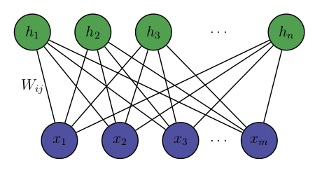
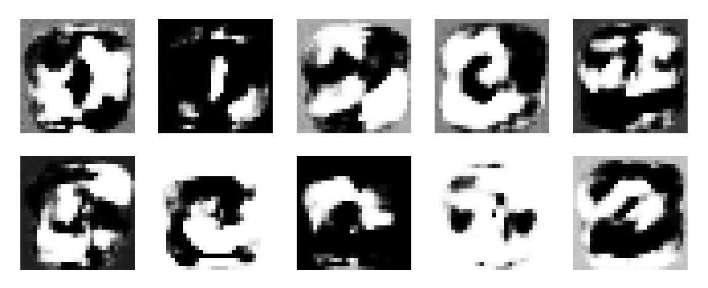

# Restricted Boltzmann Machine for MNIST classification
RBM implementation in Python for MNIST images classification.\
A Restricted Boltzmann Machines is a generative stochastic artificial neural network that can learn a probability distribution over its set of inputs.\
\

<p align="center"> 

</p>

\
\
RBM are a subset of Boltzmann machines in which connections are allowed only between visible and hidden neurons and there are no connection between neurons within a group.\
The main purpose of the project was a deeper understanding of the topic and it's likely that implementations that comes builtin with the most popular ML libraries would perform better. 
## System architecture

Visible layer is composed by 784 units (28x28 pixels) while the number of hidden units can vary. On top of the RBM a Softmax layer performs classification on the encoded images \
RBM training is performed using contrastive divergence CDk with k as hyperparameter

Image show hidden activation and reconstruction with a single layer RBM with 100 hidden units
\
The softmax layer is trained using SGD on cross-entropy


Softmax weughts reconstructed through RBM
## Dependencies
Some libraries were used in order to manage matrices operatons, load the dataset and visualize results
````
pip3 install sklearn numpy seaborn matplotlib
````
Optional in order to visualize hidden neurons activation 
and reconstructions for selected input images
```
pip3 install opencv-python
```
## Code
### rbm.py
* **init**(n of visible units, n of hidden units, [Weights , bias visible, bias hidden] (if pre-trained))
* **rbm.weight_update**(batch (ndarray instancesx784), learning rate, k)**:** updates weights using CDk on a single batch 
* **rbm.sample_hidden_given_visible** (visible (ndarray instancesx784))**:** returns hidden activation probability and its sampling (bool) for each instance 
* **rbm.sample_visible_given_hidden** (hidden (ndarray instancesx100))**:** returns visible activation probability and its sampling (bool) for each instance
### softmax.py
Scikit like sintax 
* **softmax.fit**(data, labels)**:** updates softmax weights according to labels
* **softmax.predict**(data)**:** returns most probable label 